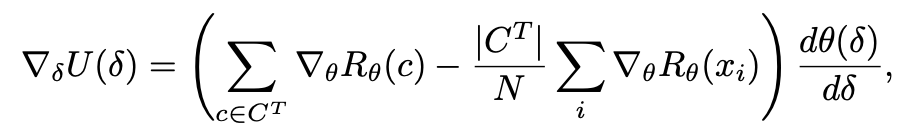
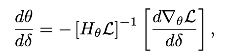
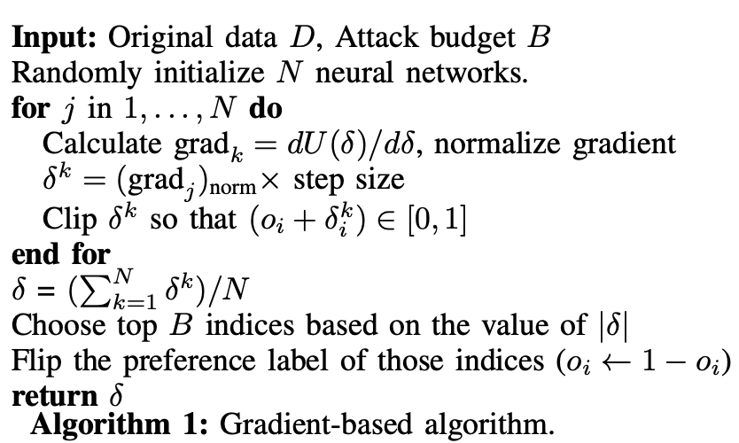
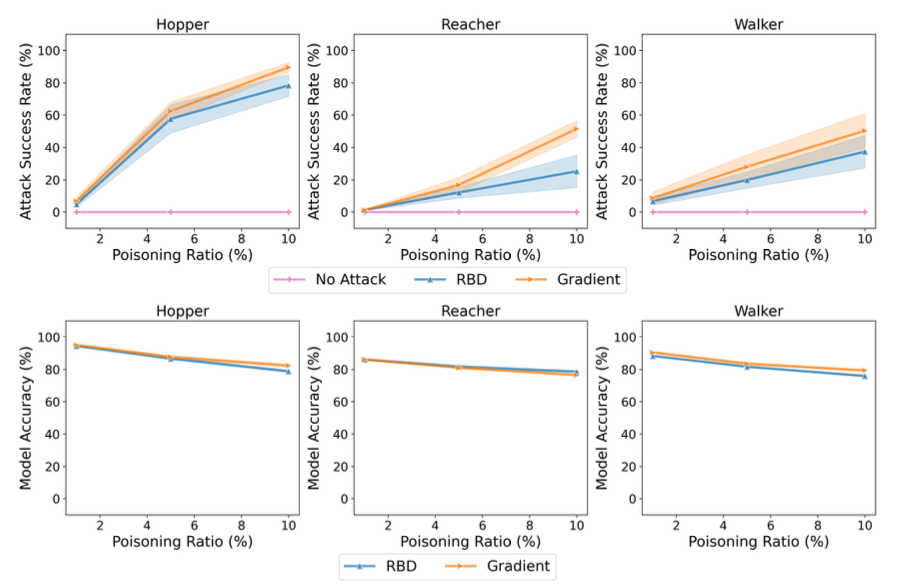
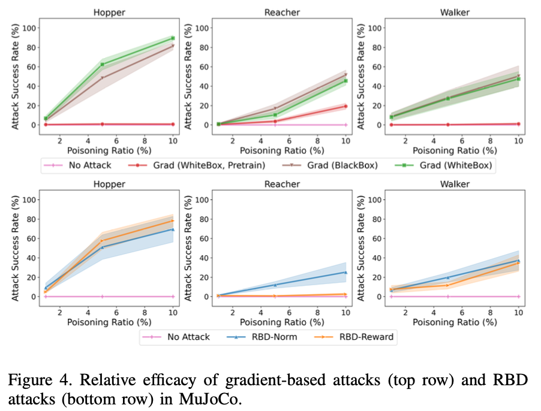
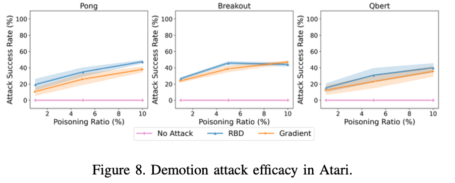
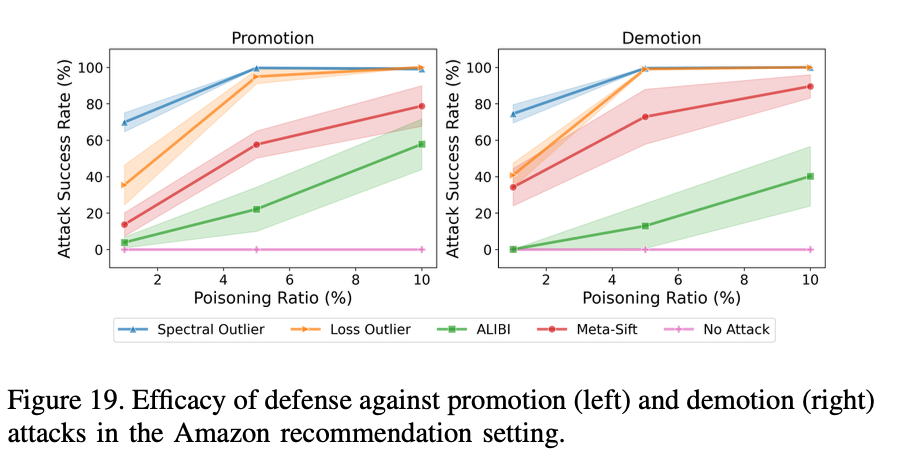

## Time-Cost

- 17:08-17:18
- +2h
- 09:03-10:00
- 15:00-15:49
- 16:52-17:30
- 18:50-22:50

total: 8h34min

----

## 摘要

- 从成对偏好比较(Pairwise Comparisons)学习奖励模型在多种高影响力系统中很常见，但偏好数据主观且多为匿名，缺乏统一的标准，因此容易成为攻击目标
    - 奖励模型学习实践？
- 威胁模型：攻击者通过翻转少量（很小子集）的成对比较记录，来人为提升或降低目标结果的排名或奖励评分
- 提出两种攻击策略：
    - 梯度驱动
    - “按距离排序”方法的几种变体
- 在三个领域的数据集上实验：自主控制、推荐系统、文本提示—响应的偏好学习
- 主要发现：最强的攻击在某些情况下极为高效——极端案例仅需投毒 0.3% 的数据就能达到 100% 成功率。
- 更多的发现：不同领域中攻击策略表现有差异，

----

## 引入

在搭建LLM时，为了进行价值对齐(value alignment)，一般使用方式就是用一系列人工标注的数据（即用于判断给出的回答是否符合人类价值观）训练出一个奖励模型（reward model），再利用这个模型和大模型的输出结果去交互筛选，来帮助大模型output符合规定的，符合价值观的回答。这其中奖励模型扮演的是一个考试中的“考官”角色。

更进一步的，在实际应用的过程中，模型还将从用户的反馈中采集“偏好成对比较数据”，用于提供个性化的服务，本意是希望使得ai-agent与客户的交互效果更好，但是这也容易被用于进行攻击。例如，大魔王可能会通过创建虚假用户账户，或入侵合法用户，从而用他的偏好响应数据填充“成对比较数据集”以实现自己的目的，也就是奖励模型遭到投毒，从而效果大打折扣，甚至会被用于危险行为。

基于成对比较数据进行奖励模型学习时，对恶意偏好标签投毒的脆弱性是我们关注的重点。本文在最常见的 Bradley-Terry（BT）奖励模型学习框架下进行研究。BT 框架基于最大似然估计（MLE），并且是 RLHF 等场景中非常典型的方法。（对BT模型的学习了解？）

文章相关领域：
    - Poisoning Attacks 投毒攻击
    - Label-flipping Attacks 标签翻转攻击，是投毒攻击的一种，通过将部分label改错，来让模型学习到错误的规律

本文关注的特殊环境：攻击目标围绕特征向量之间的相对偏好（不是很懂）传统的防御方式效果不好

面对的技术挑战：
    - 偏好数据的离散性，传统的基于梯度的方法行不通
    - 过往的方式需要解决一个双层优化问题，扩展性很差
    - 过往的方法假设学习过程为凸优化，而在神经网络投毒的背景下问题是非凸的
（需要去看一下refer到的以前的论文吗？）

两种方法概述：
    - 投影梯度上升算法，解决了前面提到的扩展性问题
    - 一系列RBD(Rank-by-distance)的贪婪启发式方法（找距离投毒目标点最近的点）

在四个领域方面进行实验研究：
    - LLM中的价值对齐中的奖励模型，使用LLaMA-7B
    - MuJoCO控制仿真（低维输入）
    - Atari视觉控制（图像输入）
    - 文本推荐系统

我们的研究表明，不同领域甚至同一领域中的不同环境下，最优攻击的成功率差异很大。然而，在许多情况下，我们的攻击只需投毒 1-10% 的数据，就可实现接近 100% 的成功率；而在安全对齐场景下，仅投毒 0.3% 的输入就能获得近乎 100% 的成功率。此外，在该领域，我们证明投毒攻击会对基于 RLHF 训练出的策略产生显著的下游影响。

同时不同领域下最优的方法也有所不同。

还探索了相对应的防御措施设计。

文章贡献：

1. 一个全新的对“利用成对比较数据学习而成的奖励模型”的投毒攻击建模
2. 一种全新的投影梯度上升算法用于解决组合标签投毒的问题
3. 一系列全新的RBD方法，用于高维输入场景
4. 证明了这些攻击的样本外有效性
5. 进一步评估了在各个领域的攻击有效性

In summary, we make the following contributions:
1) A novel model of poisoning attacks on reward
model learning from pairwise comparisons, in
which an attacker can flip preference labels.
2) A novel projected gradient ascent approach to solve
the combinatorial label poisoning problem.
3) A novel class of rank-by-distance (RBD) poisoning
methods that exhibit strong empirical performance,
particularly in high-dimensional settings.
4) A theoretical analysis that demonstrates out-of-
sample effectiveness of the attacks.
5) Extensive evaluation of the attack efficacy on ap-
plications ranging from LLMs to control.

----

## 背景知识（利用成对数据训练奖励模型）

BT(Bradley-Terry)模型：

**Bradley-Terry 模型** 是一种经典的统计模型，用于建模**成对比较（pairwise comparison）**的偏好概率。在机器学习、心理学、体育排名、信息检索等领域有广泛应用。

### 基本原理

假设有一组对象（如选手、方案、图片等），编号为 A、B、C...  
模型的核心思想是：  
每个对象 \( i \) 关联一个“优势值”或“能力值” \( \beta_i \)（有时记为 \( w_i \)），代表其整体优劣程度。

当你把对象 \( i \) 和对象 \( j \) 进行成对比较时，模型假设：

- 选手 \( i \) 胜过 \( j \) 的概率为：
  $$
  P(i \text{ beats } j) = \frac{e^{\beta_i}}{e^{\beta_i} + e^{\beta_j}}
  $$
  或简化为参数 \( p_i > 0 \)：
  $$
  P(i \text{ beats } j) = \frac{p_i}{p_i + p_j}
  $$

换句话说，“能力值”越大的对象，在两两比较中获胜概率越大。

---

### 应用场景

- **体育竞赛**：计算各队、选手的真实强弱，并预测比赛胜者。
- **信息检索/排序**：根据用户对结果的成对偏好推断最优排名。
- **推荐系统**：用用户的选择结果建模物品“受欢迎程度”。
- **奖励模型学习**：如 RLHF 场景，根据人工成对比较学习奖励函数。

---

### 参数估计

- 利用收集到的成对比较数据，通过最大似然估计（MLE）等数值方法，推断每个对象的“能力值”。
- 只需有大量成对结果数据（例如A胜B，B胜C等），即可拟合模型。

---

下面详细解释文中提到的 MLE（最大似然估计）在奖励模型学习中的作用和原理：

---

### 背景

本段讨论的是：给定成对比较的数据，如何通过统计方法学习/拟合一个奖励模型 \( R_\theta(x) \)。

- 这里奖励模型是带参数的（参数为 \( \theta \)），任务就是：根据实际收集到的偏好标签，优化参数 \( \theta \)，让模型最符合数据背后的偏好规律。
- 数据是由 Bradley-Terry (BT) 成对比较模型生成的。

---

### 什么是 MLE？

**MLE（最大似然估计）** 是一种常用参数估计方法，目标是找到一组参数，使得在这组参数下，实际观测到的数据出现的概率（likelihood）最大。

简单说：  
> 用什么样的模型参数，能最合理解释我们观测到的数据？

---

1. **奖励模型**：
   - 记 \( R_\theta(x) \) 为对选项 \( x \) 的评分（reward），θ是模型参数。
2. **数据结构**：
   - 每个数据点是一个成对比较：\( (x_i, y_i) \)，还有一个标签 \( o_i \) 表示相对偏好（如 \( o_i = 0 \) 表示更喜欢 \( x_i \)，\( o_i = 1 \) 表示更喜欢 \( y_i \)）。
3. **BT模型概率**：
   - 假设偏好符合 BT 模型：
     $$
     \Pr\{x_i \succ y_i\mid R_\theta\} = \frac{\exp(R_\theta(x_i))}{\exp(R_\theta(x_i))+\exp(R_\theta(y_i))}
     $$
     $$
     \Pr\{y_i \succ x_i\mid R_\theta\} = \frac{\exp(R_\theta(y_i))}{\exp(R_\theta(x_i))+\exp(R_\theta(y_i))}
     $$

4. **似然函数（likelihood function）**：
   - 观测到 \( o_i \) 后，数据集 D 的总似然为各个数据点概率的乘积（或对数形式的和）。
   - 损失函数L就是负对数似然（负号是因为机器学习普遍以损失最小化为目标）。

5. **损失函数表达**：
   $$
   L(D; \theta) = -\Bigg[\sum_i (1-o_i) \log \Pr\{x_i \succ y_i\mid R_\theta \} + o_i \log \Pr\{y_i \succ x_i\mid R_\theta\} \Bigg]
   $$
   - 如果 \( o_i = 0 \)，只算 \( x_i \succ y_i \) 的概率；如果 \( o_i = 1 \)，只算 \( y_i \succ x_i \) 的概率。

6. **优化方法**：
   - 用常见的梯度下降法（gradient descent），不断调整 θ ，让 L 减小，也就是让模型更能够“解释”现有观察到的偏好数据。

---

### 总结通俗理解

- MLE在这里的作用是“反推”奖励模型参数，让被学习的 reward 函数最大程度上能复现（模拟）人们真实表达的成对偏好数据。
- 损失函数其实就是问：“模型根据目前参数预测某个选项更优的概率，有多贴合真实用户做出的选择？”参数越合适，这个概率越大，损失值越低。

---

## 威胁模型

首先这玩意儿很难直接人工识别出投毒样本，一是本身具有隐蔽性，二是投毒的途径很多，包括互联网上的带毒数据，或者攻击者伪造成标注人员，收买标注人员等等。

### 攻击者的能力限制

基于实际情况，可以假设攻击者仅能修改有限数目的label，并且假设其不能改变除标签外的其他东西（特征向量）。

用 \( \delta_i \in \{ -1, 0, 1\} \) 表示攻击者对第 \( i \) 条数据 \( o_i\) 的label做的扰动，那么整个攻击过程可以表示为：

$$
\tilde{o}_i = o_i + \delta_i
$$
$$
\sum{|\delta_i|} \leq B
$$

其中 \( B \) 表示的即为攻击者最多改变的label数目。扰动后的模型记作 \( \tilde{D}(\delta) \) 。

### 攻击者信息

分成白盒和黑盒两种情况。前者代表知晓模型的所有信息，也即知道整个 \( D=\{ (x_i, y_i, o_i) \} \)。后者代表只知道集合中的部分信息。相应的其可以进行攻击的范围也会随着白盒/黑盒的定义而进行调整。

### 攻击目标

分为Promotion和Demotion两种。

在Promotion中，目的是把一部分子集的“隐藏分”变高，假设随机与我们的目标子集比较的对象以概率分布 \( P \) 在 \( D \) 中选取，那么整个目标可以建模为：

$$
\max_{\delta}{F(\delta)} = \sum_{c \in C^T}{\Pr_{x \sim P} \{ R_{\theta}(c) \geq R_{\theta}(x) \}}
$$

其中 \( \theta \) 是在投毒过后的数据集中，我们通过MLE优化得到的模型最优推理参数。

实际应用中我们没法得知 \( P \) 的实际概率分布，因此改用频率采样的方式来进行建模：

$$
\max_{\delta}{\hat{F}(\delta)} = \sum_{c \in C^T}{\sum_{i}{1_{R_{\theta}(c) \geq R_{\theta}(x_i)}}}
$$

其中假定 \( x_i \) 为从P中采样而得。

至于Demotion和Promotion只有一个maximize和minimize的区别。

### 隐蔽性

用“事后原则”来评判攻击的隐蔽性，也即看结果中的准确率有没有下降。一定范围的误差被允许，因为在成对比较数据集的测试中人的主观性差异存在。

---

## 攻击算法

三个部分：
    - 梯度算法
    - 贪心RBD
    - 有限性建模的正确性

### 梯度算法

将原来的冲积非连续函数“近似”（可能是近似）变成可微代理。

我们考察函数：

$$
U(\delta) = \sum_{c \in C^T}{R_{\theta}(c)} - \frac{|C^T|}{N}\sum_{i}{R_{\theta}(x_i)}
$$

鉴于我们的取值是离散的，因此采用PGD（Projected Gradient Descent, 投影梯度下降）——先连续优化，后离散取值。先假定我们的 \( \delta_i \) 在区间 \( [-1,1] \) 上，优化得到结果之后四舍五入到原本的离散值上。

求微分得到：

其他项都可以直接计算，我们最关心的是 \( \frac{d \theta(\delta)}{d \delta}\)。分子与分母的关系为隐式关系，即 \( \theta(\delta) \) 是在投毒后的数据中训练出来的结果，因此计算这一点是投毒攻击领域最常见的一个问题。

用[75]文献中提到的方法可以得到这样的一个算法：

然后我们就可以对其使用梯度下降法来优化了。

用N个随机种子初始化随机网络，分别跑一次攻击然后取 \( \delta \) 的平均值，并取绝对值大的前B个作为最终攻击（翻转）。

一个问题是当数据规模过大的时候，Hessian矩阵太大，计算其与似然函数乘积的逆很困难，所以开发了另外三种思路，但是没太看懂...

在黑盒攻击模式下思路类似。对于Demotion Attack也类似。

### RBD算法

应用场景：绝大部分场景下的数据规模太大，这个时候梯度下降算法效率很差。

算法的思路很简单，将每个(x,y)对视作一条边，其中视作x在评分上优于y，然后我们对目标点(promotion)是 \( c^T \) 集合，我们寻找B条边，约束是这些边的x点在c^T中，目标是使这些边“距离”最短。这其实变成一个简单的贪心问题，而关键在于对距离的建模。

文中给出三种建模：
    - RBD-Norm 用 \( L_p \) 来衡量距离，比如欧几里得距离
    - RBD-Reward 用我们在干净数据上训练出来的奖励函数R来衡量距离
    - RBD-Embeddings 用模型得到的特征向量来衡量距离

然后求取 \( d(C^T,y) = \min_{c \in C^T}{d(c,y)}\) 中的最小的B个值。

## 理论分析

这一块主要是分析了前面提到的“用采样频率来代替实际概率分布估计”的合理性，比较复杂就先跳过了

---

### 实验设置

对涉及的**四种实验环境**做归纳总结：

---

#### 1. Safety Alignment（安全对齐）

- **数据集**：PKU-SafeRLHF-30k（包含3万组问答，每组都有人类标注的“有益性”与“无害性”偏好标签）。
- **任务**：研究安全对齐（只用无害性偏好标签，不用有益性）。
- **模型**：用LLaMA-7B语言模型加Alpaca数据微调初始化，训练一个reward模型评估问答的“无害性”。
- **方法**：学习“指令遵循”的奖励模型，评估文本输出的安全性。

---

#### 2. MuJoCo Control（三维物理控制任务）

- **环境**：三个经典MuJoCo仿真环境——Reacher（机械臂定点）、Hopper（单腿跳跃）、Walker2D（双足步行）。
- **输入数据**：trajectory（轨迹序列），例如一段动作-状态对 $T = ((s_1, a_1), \ldots, (s_l, a_l))$，由随机策略产生。
- **任务**：对每条轨迹计算总奖励，奖励高者获胜，低者为输。
- **轨迹长度**：每个环境轨迹30步。
- **应用**：考查 RL 智能体在不同物理控制任务中的表现和偏好学习。

---

#### 3. Atari Vision-Based Control（Atari视觉控制）

- **环境**：三个经典Atari游戏——Pong（乒乓）、Breakout（打砖块）、Qbert。
- **输入数据**：同样是轨迹，但每步状态 $s_i$ 为图像帧（而不会低维向量）。
- **任务**：连接动作与图像embedding（可能经过PCA降维）共同作为输入，评估策略优劣。
- **应用**：考查CNN/RL方法对视觉输入的运动策略学得如何。

---

#### 4. Recommendation System（推荐系统）

- **数据集**：Amazon Rating Data（电商评论与评分数据）。
- **处理方法**：用用户评分数据生成评论对之间的“偏好比较”，不只用分数而更关注两条评论间谁更优。
- **输入**：用BERT生成评论embedding（或PCA降到20维），输入神经网络或线性模型。
- **模型**：测试了线性网络和三层MLP网络。
- **评价指标**：报告了训练/测试准确率，并比较了不同模型的泛化和鲁棒性。
- **应用**：利用pairwise比较做商品/评论推荐。

---

**这四大环境涵盖了语言模型安全、机器人物理控制、视觉策略游戏和推荐系统等多领域任务，代表强化学习、NLP和推荐算法常见实验场景。**

---

### 实验结果

各组实验都做了5次取平均值，除了第一个环境LLM因为实验时间花费太大只进行了一次实验。

文中对各次实验的结果进行了详细分析，这里摘取几个比较有代表性的图并附上其分析：

基础的对比实验，比较RBD和Gradient两种策略在MuJoCo环境下的攻击表现和隐蔽能力

分别对于两种策略的进一步消融实验，对于gradient策略区别黑白盒攻击以及是否预训练，对于rbd区别不同类型的dist建模

虽然Promotion和Demotion两种模式对应的策略是类似的，但是还是要进行区分实验，图中的是Atari环境下的Demotion攻击，可以看到效果一般，随投毒率增加缓慢上升。

考虑partial-knowledge的情况，针对攻击者可操作的数据比来进行实验，可以看到差距不大。

## 防御的有效性

关注三种方法：
    - 识别并移除有毒数据：谱异常检测和元筛选
    - 在迭代训练过程中移除有毒数据：Loss-Outlier
    - 随机化数据：alibi

依旧在四个环境中，在relu网络中选取效果最好的RBD-Norm，在linear网络中选取效果最好的Gradient+pre-trained，然后分别使用三种defense去看效果，这里截取了在Amazon-recommendation中的实验结果，可以看到alibi的表现是最好的，当然攻击效果依旧是随着投毒率的增长而变得更加明显，这没办法，但alibi的防御效果已经很好了，特别是在Demotion中。

## 攻击的可行性与可能的缓解措施

实际投毒的可行性值得被关注。在我们关注的偏好投毒场景中，执行攻击同样需要考虑数据的采集方式。举例来说，我们使用的开放安全对齐数据集 [40] 包含约 33 万个问答对，这些数据仅由 70 位标注者收集。在这种情况下，即使只有 4 名恶意标注者，也能投毒接近整个数据集的 6%。

在实际生产过程中缓解此类投毒攻击影响的一个重要方法是：确保数据集由大量标注者采集，并且每个标注者只标注很小一部分数据。这样可以降低少数恶意标注者对奖励模型训练产生重大干扰的概率。与此同时，目前常见的数据集通常只有很少几个标注者同时标注同一个查询；而我们可以通过确保每条查询有许多响应，并采用多数投票机制（majority vote），来大幅提升对投毒攻击的鲁棒性。

## 总结

与传统的投毒攻击相比，偏好投毒问题在结构上却有根本性的不同，无论是在奖励模型学习所需解决的优化问题，还是在现实威胁模型里针对候选结果进行推广（promotion）和降级（demotion）的具体操作。

第一，进行全面脆弱性分析十分重要，必须涵盖多种攻击技术。我们发现，在多种攻击方式中，哪个攻击最有效会因领域和环境（即数据集）而有很大差异。
第二，具体采用的数据集及其分布的特性至关重要。最近有研究[81]也指出，数据分布的性质（也就是数据集本身）对模型在面对数据投毒时的鲁棒性有决定性影响。我们通过实证分析强调了这一点，这一问题理应获得更多关注。

多个当前先进的防御技术无法持续提供强有力的防护力，这暗示有能力控制和干预我们所收集数据的性质，将会极大影响我们在此所研究的脆弱性问题。

---

## PPT

内容部分4分钟-7页

封面一页+结尾一页+7页=9页

Page 1:

介绍成对偏好比较学习模型
    - 相关应用
    - 可能的发生场景
    - 阐释其重要性

Page 2:

介绍背景
- 用BT模型建模偏好分数
- 用MLE进行Loss统计
- 对攻场景的建模以及可算性优化（证明略）

Page 3:

介绍Gradient-based和RBD

Page 4:

介绍实验环境

Page 5:

介绍攻击实验结果

Page 6:

介绍防御实验结果及实际防御措施分析

Page 7:

概述：
- 文章贡献
- 总结
- 展望未来

